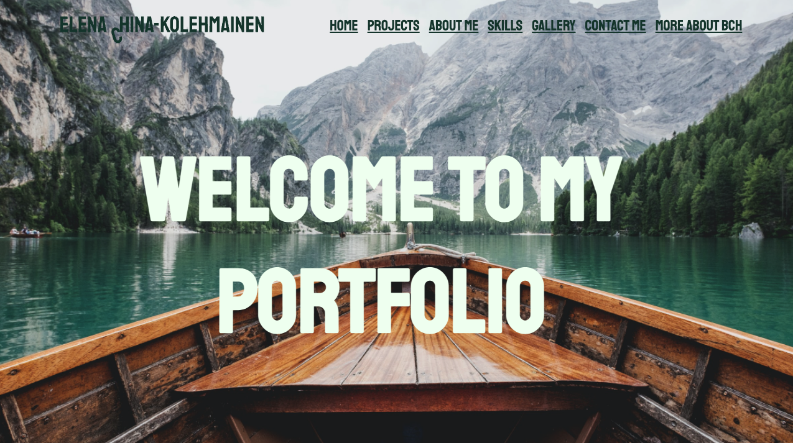
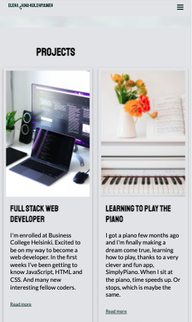
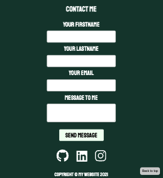

# A portfolio project to practice HTML, CSS and JS.

### Credits
- Background photo by <a href="https://unsplash.com/@lucabravo?utm_source=unsplash&utm_medium=referral&utm_content=creditCopyText">Luca Bravo</a> on <a href="https://unsplash.com/?utm_source=unsplash&utm_medium=referral&utm_content=creditCopyText">Unsplash</a>
  

- Computer photo by <a href="https://unsplash.com/@walling?utm_source=unsplash&utm_medium=referral&utm_content=creditCopyText">Walling</a> on <a href="https://unsplash.com/s/photos/coding?utm_source=unsplash&utm_medium=referral&utm_content=creditCopyText">Unsplash</a>
  
  
- Piano photo by <a href="https://unsplash.com/@kiralaktionov?utm_source=unsplash&utm_medium=referral&utm_content=creditCopyText">Kira Laktionov</a> on <a href="https://unsplash.com/s/photos/piano?utm_source=unsplash&utm_medium=referral&utm_content=creditCopyText">Unsplash</a>

- Plants photo by <a href="https://unsplash.com/@renran?utm_source=unsplash&utm_medium=referral&utm_content=creditCopyText">Ren Ran</a> on <a href="https://unsplash.com/s/photos/plants?utm_source=unsplash&utm_medium=referral&utm_content=creditCopyText">Unsplash</a>
  
- Responsive mobile navigation menu inspired by RichardCodes [Responsive Mobile Navbar Menu Tutorial with HTML, CSS and Javascript](https://www.youtube.com/watch?v=VMxP9PMSOYM&t=685s)
  
  
## Link 

https://wizardly-banach-f81bd9.netlify.app/